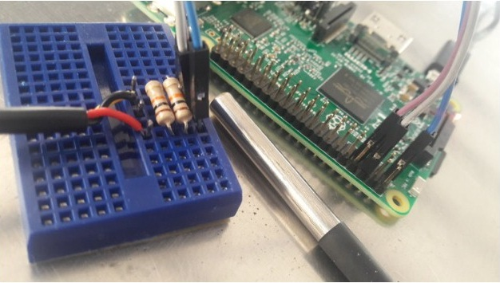

#Sensor de temperatura con RaspberryPi

#Materiales
RaspberryPi 3
Sensor DS18B20

Resistencias de 4,7K

# Código python

Códigos
En código sensor.py puede ser copiado del texto siguiente:
import os

import glob

import time

os.system('modprobe w1-gpio')

os.system('modprobe w1-therm')

base_dir = '/sys/bus/w1/devices/'

device_folder = glob.glob(base_dir + '28*')[0]

device_file = device_folder + '/w1_slave'

def read_temp_raw():

f = open(device_file, 'r')

lines = f.readlines()

f.close()

return lines

def read_temp():

lines = read_temp_raw()

while lines[0].strip()[-3:] != 'YES':

time.sleep(0.2)

lines = read_temp_raw()

equals_pos = lines[1].find('t=')

if equals_pos != -1:

temp_string = lines[1][equals_pos+2:]

temp_c = float(temp_string) / 1000.0

return temp_c

while True:

print("La temp es: "+str(read_temp())+" ˚C")

time.sleep(0.5)
